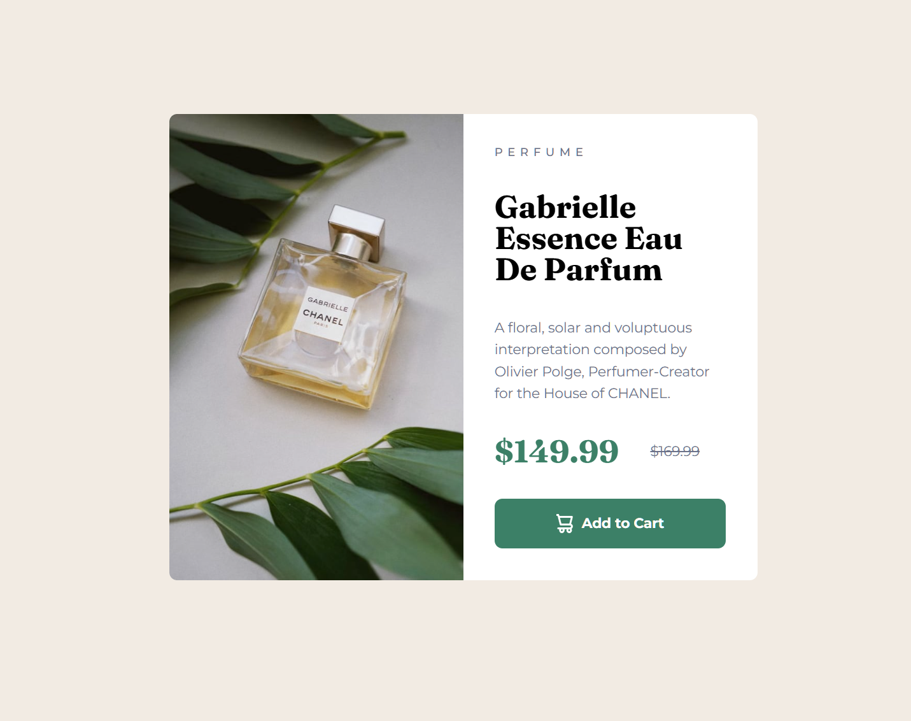

# Frontend Mentor - Product preview card component solution

This is a solution to the [Product preview card component challenge on Frontend Mentor](https://www.frontendmentor.io/challenges/product-preview-card-component-GO7UmttRfa).

## Table of contents

- [Overview](#overview)
  - [The challenge](#the-challenge)
  - [Screenshot](#screenshot)
  - [Links](#links)
- [My process](#my-process)
  - [Built with](#built-with)
  - [What I learned](#what-i-learned)
  - [Continued development](#continued-development)
  - [Useful resources](#useful-resources)
  - [AI Collaboration](#ai-collaboration)

**Note: Delete this note and update the table of contents based on what sections you keep.**

## Overview

### The challenge

Users should be able to:

- View the optimal layout depending on their device's screen size
- See hover and focus states for interactive elements

### Screenshot

### Links

- Live Site URL: [https://bsunsten.github.io/FMIO-Product-Preview-Card/](https://bsunsten.github.io/FMIO-Product-Preview-Card/)

## My process

### Built with

- Semantic HTML5 markup
- Dart SASS
- Flexbox
- CSS Grid
- Mobile-first workflow

### What I learned

The major new tech I utilized in this project was SASS, which I hadn't worked with before.

I really like how it lets you break up your CSS into partials (similar to CSS modules). 
I also found the mixin feature super useful! 

During the project I also made sure to utilize the figma file which helped me get things pretty close to the design. 

### Continued development

I want to continue to use SASS if i'm not using a component based framework, as it seems like a great way to add on to vanilla CSS. I'd like to test it against Tailwind, which I've used very sparingly. 

### Useful resources

- [Learn Sass in 20 minutes by 'developedbyed'](https://www.youtube.com/watch?v=Zz6eOVaaelI) - This was a straightforward intro to using sass and covered the basics really quickly!

### AI Collaboration

I utilized Claude code when I got stuck working on this project. 

This primarily helped me with some layout structures, and advised me on how to use flex-basis when the content div's padding was causing it to take up more than 50% of the card in the desktop style. 
